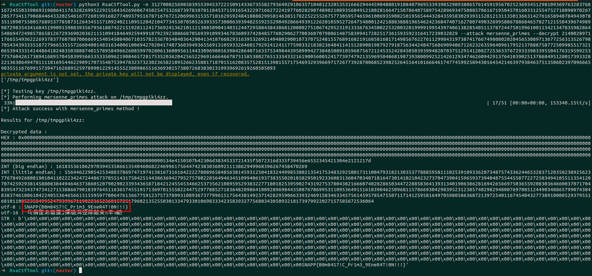

# 1. Challenge Code / Description

```python
#!/usr/bin/env python3
from Crypto.Util.number import *
from flag import flag

def check(n):
  sn = str(n)
  l, P = len(str(n)), []
  for i in range(1, l - 1):
    for j in range(i + 1, l):
      g, e, a = int(sn[:i]), int(sn[i:j]), int(sn[j:])
      if isPrime(g ** e + a):
        P.append(g ** e + a)
      if isPrime(g** e - a):
        P.append(g ** e - a)
  return P

def keygen(nbit):
  while True:
    r = getRandomNBitInteger(18)
    if len(check(r)) != 0:
      cr = check(r)
      cr.sort()
      p = cr[-1]
      if p.bit_length() >= nbit:
        return r, p

def encrypt(msg, pubkey):
  m = bytes_to_long(msg)
  assert m < pubkey
  c = pow(m, 65537, pubkey)
  return c

p, q = keygen(256)[1], keygen(256)[1]
pubkey = p * q
enc = encrypt(flag, pubkey)

print(f'n = {pubkey}')
print(f'enc = {enc}')

```

# 2. Solution
At the first view I couldn't understand the prime generation algorithm neither in static nor dynamic approach. So I passed the `n` to [RsaCtfTool](https://github.com/RsaCtfTool/RsaCtfTool) to see what is the issue about generating primes in this strange way. this is the output of the tool


so it is all about [mersenne primes](https://en.wikipedia.org/wiki/Mersenne_prime), after searching about them it seems they are primes that are in form of `2**n - 1`. I generated two primes with this algorithm to examine them


it seems these numbers are not form of `2**n - 1` but the number 1 may be different for them so I used this code to find what form they are in:

```python
p = 858099707516326214372737599885174152158679412517913176174307932398192897924707006515319955082681819372162038923935107254640248499964580476571753536389382243
q = 2462625387274654950767440006258975862817483704404090416746768337765357610718575663213391640930307227550414249394111

for i in range(-1000, 10000):
	if (p + i) % 2**32 == 0:
		print(f"p => 2**n - {i}")
	if (q + i) % 2**32 == 0:
		print(f"q => 2**n - {i}")
```


so in this example we see that p is in form of `2**n + 99` and q is in form of `2**n - 65`
Finally I used RsaCtfTool to decrypt the c with mersenne primes method

