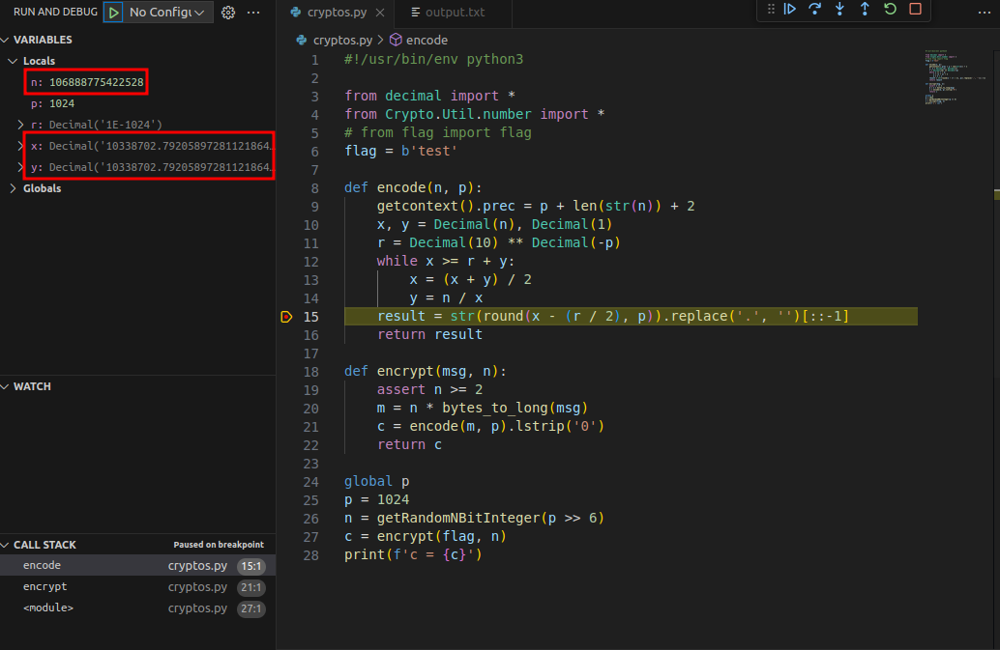
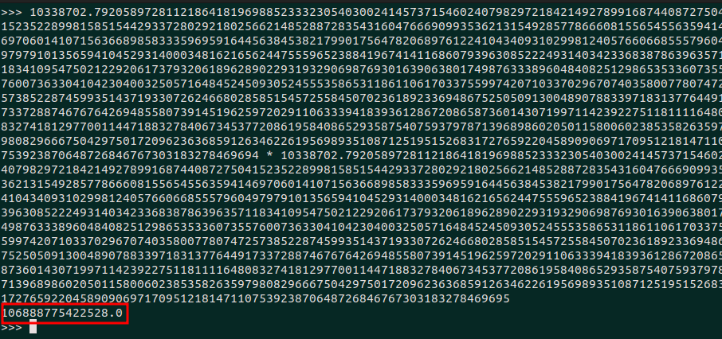

# 1. Challenge code / description
Discover the world of [**cryptos**](https://snappctf.com/tasks/cryptos_da1c562d0ed97239d393ba195d68edc3afa46f48.txz) in SNAPP CTF, solve challenges, and kindle your love for cryptography with exciting tasks.

```python
#!/usr/bin/env python3

from decimal import *
from Crypto.Util.number import *
from flag import flag

def encode(n, p):
  getcontext().prec = p + len(str(n)) + 2
  x, y = Decimal(n), Decimal(1)
  r = Decimal(10) ** Decimal(-p)
  while x >= r + y:
    x = (x + y) / 2
    y = n / x
  result = str(round(x - (r / 2), p)).replace('.', '')[::-1]
  return result

def encrypt(msg, n):
  assert n >= 2
  m = n * bytes_to_long(msg)
  c = encode(m, p).lstrip('0')
  return c

global p
p = 1024
n = getRandomNBitInteger(p >> 6)
c = encrypt(flag, n)
print(f'c = {c}')
```

# 2. Solution 

the code is pretty much simple, it's encoding a message in these steps:

1. it generates a `(1024>>6)` or 16 bit random number [32768, 65536]
2. multiply flag decimal value by it
3. encode it using this algorithm
	1. $x = n, y = 1$
	2. $x = (x+y) / 2$ , $y = n/x$
	3. repeat until $x >= y + r$ : (r is very small value near to zero)
4. round `x` by `p` floating point which is $1024 + len(n) + 2$
5. eliminate the `.` and reverse it

if we switch to dynamic approach we can see that the loop is about taking square root of initial value





so the encode function will be simply like this

```python
def encode(n, p):
  getcontext().prec = p + len(str(n)) + 2
  x, y = sqrt(n)
  result = str(round(x - (r / 2), p)).replace('.', '')[::-1]
  return result
```

to get `m*n` we should first reverse the result then power it up to exponent 2 

I used this code to do that
```python
c = '5045178894357626075431384420860360647034114401723872009235472900716359915220507491073960091678247276121410336208043903213023270852375878447784137648224298070437468162688759757920721723781604874151511572882769621941513872944171938170800255953999521262507633248122058585326636562475057264132441892290385234155811673238225858794265110896113943435633328964169010801463217935967353264871894098875705195581754210881067786818256285938683517110450003983693265702180080692280190636422223594905498601205618208238650519192521153660957941553495169629553425307135627310090665836554328620333233651748363605006405700561070148067374204713428800371202120708720303368873063856187395746236050232433322757367599705756026681249243491427692831512293583163552663661247047141621453850846452005560242532098020050458041224274532870717854358073569467859182280543593485795867269334718276231423506951784977870960076921603401799962900400216905993065516167476079796078242649399762978533503541077936264107413956207423841535073828559129349967201715665207852577917834390795702440085535969037233161141789375751'
c = c[::-1].replace('.', '')
mn = int(str(int(c) ** 2)[:-2048]) + 1
```

the reason I remove the the floating point `.` and calculate it's second power then eliminate last 2048 digits is a basic mathematical method we learnt in fourth class
it is about multiplying float numbers which says multiply the numbers without considering the floating point, after multiplying them add the floating point for sum of number of digits for two numbers which here is `2*1024=2048`. at the end I add an extra  `1` because the floating most significant digits are all 9 which means we need extra 1.

here is the final code which decode the flag

```python
from Crypto.Util.number import *

c = '5045178894357626075431384420860360647034114401723872009235472900716359915220507491073960091678247276121410336208043903213023270852375878447784137648224298070437468162688759757920721723781604874151511572882769621941513872944171938170800255953999521262507633248122058585326636562475057264132441892290385234155811673238225858794265110896113943435633328964169010801463217935967353264871894098875705195581754210881067786818256285938683517110450003983693265702180080692280190636422223594905498601205618208238650519192521153660957941553495169629553425307135627310090665836554328620333233651748363605006405700561070148067374204713428800371202120708720303368873063856187395746236050232433322757367599705756026681249243491427692831512293583163552663661247047141621453850846452005560242532098020050458041224274532870717854358073569467859182280543593485795867269334718276231423506951784977870960076921603401799962900400216905993065516167476079796078242649399762978533503541077936264107413956207423841535073828559129349967201715665207852577917834390795702440085535969037233161141789375751'
c = c[::-1].replace('.', '')
mn = int(str(int(c) ** 2)[:-2048]) + 1

for n in range(2**15, 2**16):
    if mn % n == 0:
        m = mn // n
        flag = long_to_bytes(m).decode()
        if 'SNAPP' in flag:
            print(flag)
```

